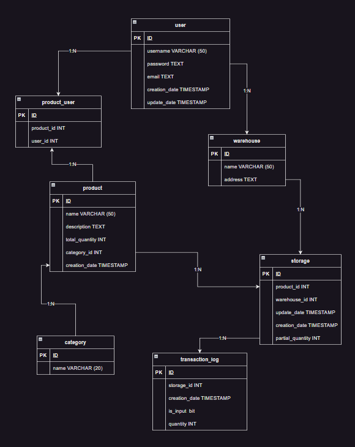
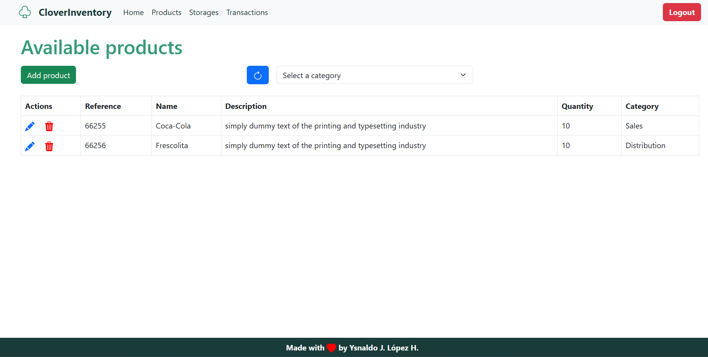
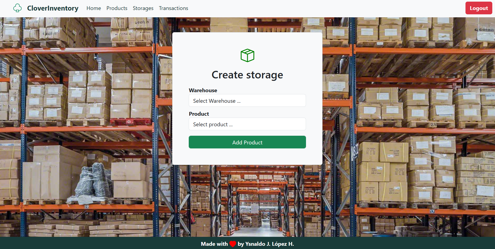
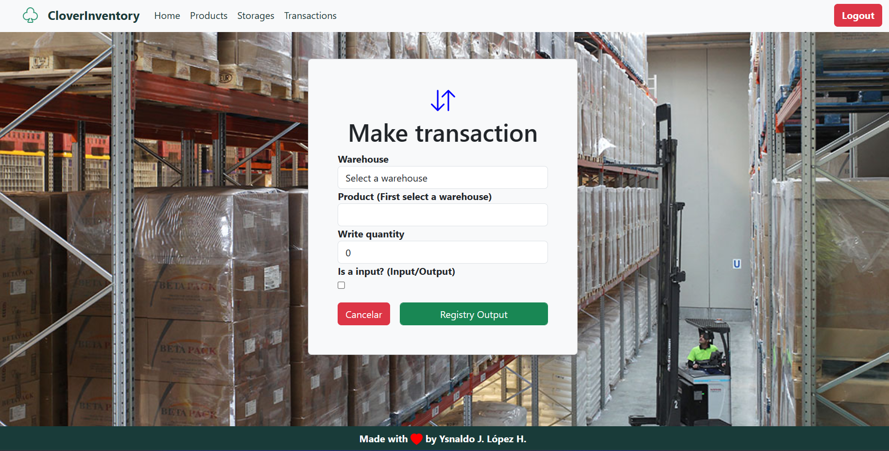

#  Clover Inventory

## Overview 

This project was carried out for learning purposes; it is oriented to the implementation of an inventory manager for any business, company or enterprise.

The topics applied in the mentioned project are the following. 

1. Management of ***Blazor Server*** in integration with .NET 6.
2. Relational database design (SQL).
3. PostgreSQL management.
4. Management of .NET 6 in integration with Blazor engine. 
5. Handling of Entitiy Framework (FluentAPI).
6. Realization of authentication model based on permissions for access to specific functionalities and views. 
7. DDD (Drive Domain Design) architecture pattern management.
8. Use of HTML, SASS and Bootstrap.

## Table of Contents

1. How to run. 
2. Entity-relationship diagram
3. Quick Start Manual
4. Technologies used.
5. Resources.

## How to run

For run this project you need the next requirements.

- [.NET Core 6.0 Version](https://dotnet.microsoft.com/en-us/download).
- [PostgresSQL](https://www.postgresql.org/download/)
  
***Recommended*** 

- Database management tool - [DBeaver](https://dbeaver.io/)

To run the project please go to the InventoryManager.Views project directory to find the program class. Then run the following command.

        dotnet run

You will see the next logs.

    EntityFramework Logs - Database Created
    info: Microsoft.Hosting.Lifetime[14]
      Now listening on: https://localhost:7242
    info: Microsoft.Hosting.Lifetime[14]
        Now listening on: http://localhost:5242
    info: Microsoft.Hosting.Lifetime[0]
        Application started. Press Ctrl+C to shut down.
    info: Microsoft.Hosting.Lifetime[0]
        Hosting environment: Development
    info: Microsoft.Hosting.Lifetime[0]
        Content root path: C:\YourDirectory\InventoryManager\InventoryManager.Views
    info: Microsoft.Hosting.Lifetime[0]
        Application is shutting down...

## Entity-relationship diagram

The following is a list of all project entities.

## Quick Start Manual

For the full use of all the functionalities it is necessary to be logged in as administrator with the following credentials. 

**User:** Admin 

**Password:** admin

Additionally, you can validate the absence of some functionalities using the following user. 

**User:** Test

**Password:** test

The modules of operation of the application are. 

1. Product view **(creation, edition and deletion must be logged in as administrator)**.
2. Login view.
3. Registration View. 
4. Transaction view **(You need to be logged in as an administrator)**.
5. View of storage in warehouses **(You need to be logged in as an administrator)**.

### Products view

In this view you can review all the products that are available in warehouses; additionally, you can filter in the table by the existing categories.

To be able to add, edit and delete products you need to be logged in as an administrator. 

### Storage view

Here you can store the products previously created in the respective warehouses.

### Transaction view

Here you can perform incoming and outgoing transactions for the transitory products in the warehouses.  

## Technologies used

* Blazor Server (.NET 6.0)
* [.NET Core](https://dotnet.microsoft.com/en-us/download): Version 6.0
* [PostgresSQL](https://www.postgresql.org/): Version 12
* [EntityFrameworkCoreNpgsql](https://www.nuget.org/packages/EntityFramework6.Npgsql/): Versin 6.

## Resources 

### Diagrams 

This project has the following diagrams.

* Entity Relationship Diagram (ER)

For see this diagram use [diagrams .net](https://www.diagrams.net/).

*Download*

   **PATH:**
   
[`./InventoryManager/Resources/inventoryManagerArchitecture`](Resources/blogApplicationRelationsDiagram)
